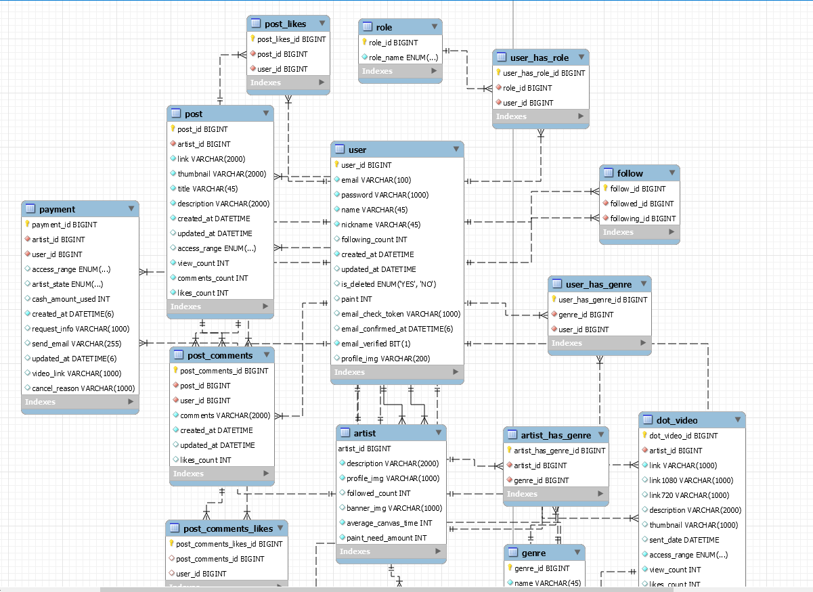
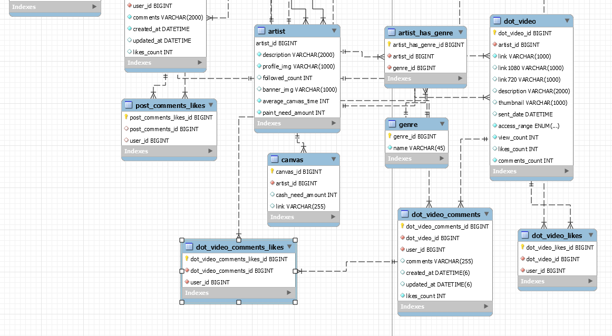

# :package: 블루닷


* 프로젝트 기간: 2020.08 ~ 2021.01

___

# 📌 Database Schema





# AWS

# AWS 사용한 서비스들

>
**0.IAM** (authorization and security of aws)<br/>
**1.EC2** (server)<br/>
**2.RDS** (database)<br/>
**3.S3**  (storage)<br/>
**4.Elastic** Transcoder (video converter)<br/>
**5.lambda** (using automatic of video)<br/>
**6.Cognito** (user authorization)<br/>

# 1. EC2

> Ec2 ubntu version 20.04 사용.  <br/>
원래는 18.04를 사용해봤었는데 20.04 버전이 더 빠르고 안정적이라고 생각이 된다.

> termius 세팅방법
>>https://technote.kr/299

# 2. RDS

> 인바운드 규칙과 아웃바운드 규칙을 아래의 글에 나오는 EC2뿐 아니라 위치무관에 대해서도 허용을 해주어야 pc에서 접근이 가능하다 <br/>
>>https://victorydntmd.tistory.com/337 <br/>

> EC2에서 mysql
>sudo apt update # MySQL 설치를 위해 업데이트 <br/>
sudo apt install mysql-server # MySQL 서버 설치 <br/>
sudo mysql -u root -p # MySQL 접속 <br/>
(mysql -u admin -p -h bluedot-rds.cnyobjdzyehq.ap-northeast-2.rds.amazonaws.com) <br/>
>>https://ndb796.tistory.com/314

# 3. S3


> elastic transcode 사용을 위해 input, output, 그리고 image 파일들을 담을 버킷 총 3개를 생성
생성할 때 객체는 모두 public으로 생성했다.

# 4. Elastic Transcoder + 5. lambda

> 간단 사용법 설명 동영상 ( using console )
>>https://www.youtube.com/watch?v=VzAaNKBH0NE&ab_channel=SaMtheCloudGuy

> 어떻게 돌아가는가?
>>https://www.javatpoint.com/aws-elastic-transcoder

> 세팅법
>> https://jeongchul.tistory.com/581 <br/>
>> https://jeongchul.tistory.com/582 <br/>

> region -> ap-northeast-1 ( japan, toyko 로 설정해야 한다. )

> blog 글요약
1. IAM 에서 lambda 사용자를 만든다.
2. lambda 사용자에게 lambda와 s3관련 인라인 정책을 추가해준다.
3. pipeline을 생성한다
4. lambda를 작성한다
5. lambda와 s3를 연결해준다.

<hr/>

# Swagger

> 참조 블로그 ( 위의 링크를 주로 참조 )
>>https://victorydntmd.tistory.com/341 <br/>
>>https://jojoldu.tistory.com/31

# Swagger 사용법 및 코드 참조

> 희찬 졸업작품 sever <br/>
>> https://github.com/LOG-INFO/sticket-server

# Excel to sql

>>http://beautifytools.com/excel-to-sql-converter.php

# Convertio ( N to M )

>>https://convertio.co/kr/

### 파일 이름 한번에 바꾸기

vsc에서 클릭하고 ctrl + D

# lambda 코드 관련


presetId ? -->


https://docs.aws.amazon.com/ko_kr/elastictranscoder/latest/developerguide/system-presets.html ( preset )

## 공식문서

>>https://docs.aws.amazon.com/ko_kr/elastictranscoder/latest/developerguide/elastictranscoder-dg.pdf

## thumnail 관련

```javascript
'use strict';
var AWS = require('aws-sdk');

var elasticTranscoder = new AWS.ElasticTranscoder({
    region: 'ap-northeast-1'
});

exports.handler = function(event, context, callback){

    var key = event.Records[0].s3.object.key;

    //the input file may have spaces so replace them with '+'
    var sourceKey = decodeURIComponent(key.replace(/\+/g, ' '));

    //remove the extension
    var outputKey = sourceKey.split('.')[0];

    var params = {
        PipelineId: '',
        Input: {
            Key: sourceKey
        },
        Outputs: [
            {
                Key: outputKey + '-1080p' + '.mp4',
                PresetId: '1351620000001-000001' //Generic 1080p
                ,
                ThumbnailPattern:'thumbnail/{count}/'+ outputKey
            },
            {
                Key: outputKey + '-720p' + '.mp4',
                PresetId: '1351620000001-000010' //Generic 720p
            },
            {
                Key: outputKey + '-web-720p' + '.mp4',
                PresetId: '1351620000001-100070' //Web Friendly 720p
                // ,
                // ThumbnailPattern:'thumbnail/{count}/'+ outputKey
            }
        ]};


    elasticTranscoder.createJob(params, function(error, data){
        if (error){
            callback(error);
        }
    });
};
```
* 유의점 -> lambda region을 toyko로 맞추어야 한다. 현재 aws 계정에 region이 seoul로 돼있는 곳에 코드 써봤자 안먹음.
* thumbnailPattern에서 오류가 나면 변환이 안되고 멈춰버림 ( thumbnail pattern으로 변환하는 것은 맞음. 변환하는 것 확인 )
* ThumbnailPattern:'thumbnail/{count}/'+ outputKey
  -> outputkey로 주고 싶으면, 앞에 슬래시를 하나 넣어주어야 한다.
* 변환된 파일을 동기적으로 파일이 담길때까지 기다렸다가 반환하기